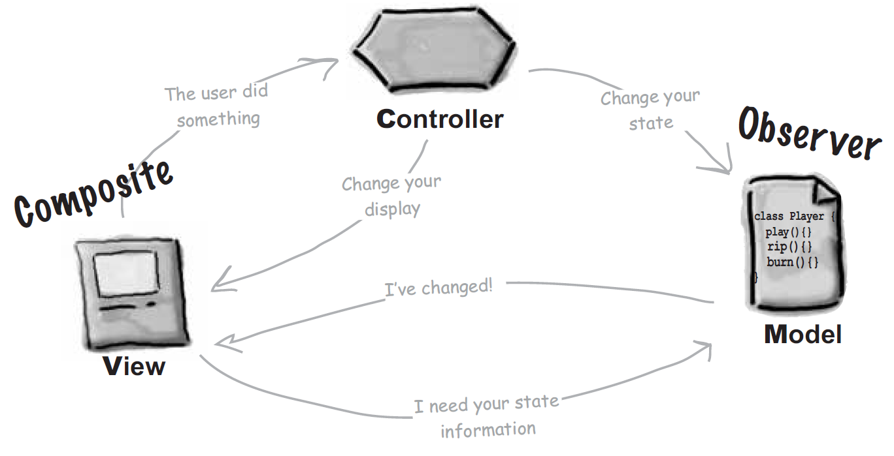

> Sorry for my bad English 😢

(Image Source : Head First Design Pattern [O'Reilly Media] )

# **C**ontroller

- The controller implement the Strategy Pattern.
- The controller can change the state of the application.
- So, the view can be only concerned with the visual aspects, and the model can do its role as the core of application.

# **M**odel
- The model is the core of application, and has all of the application's state informations.
- However, it delegates to the controller for changing the state, and to the view for the visual aspects.
- And Whenever the model's state is changed, the model notifies this information to the view. 
- In ohter words, the model and the view implement the Observer Pattern where the view is the observer of the model.

# **V**iew
- The view consists of a nested set of UIs.
- So, you can say that the view implements the composite pattern.

# Reference

- Head First Design Pattern (O'Reilly Media)

